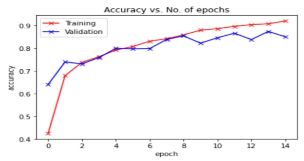
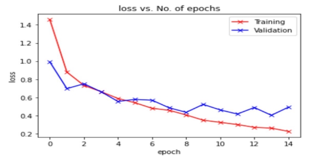
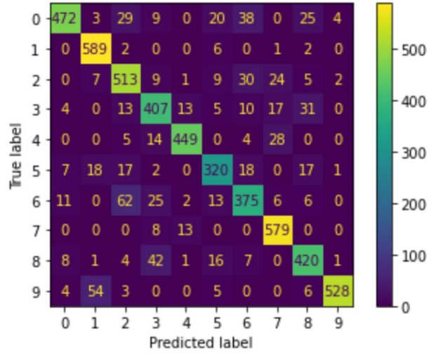

Agnik Saha(Roll: 21CS60A01)

I have followed steps:

1. Loading training, validation and test dataset
1. Preparing train\_loader , val\_loader & test\_loader
1. Creating a train\_model function that trains the model and this function returns training accuracy and training loss
1. Creating validate\_model function test the model and this function returns test accuracy and test loss
1. Define our model **Eurosat\_CNN**
1. Model fitting step -> Here we fit our model using train\_model and validate\_model function

Hyperparameters used in **Eurosat\_CNN** model

|Hyperparameter|Value|
| - | - |
|Optimizer|Adam|
|Learning rate|0.001|
|Weight decay|0|
|Early stopping patience|5|
|epochs|15|
|Dropout rate|0.5|
Accuracy vs No of epochs plot:

Loss vs No of epochs plot:

Accuracy of test data is 0.8637037037037038 Accuracy of validation data is 0.8596866096866097

A Confusion matrix is an N x N matrix used for evaluating the performance of a classification model, where N is the number of target classes. The matrix compares the actual target values with those predicted by the machine learning model. This gives us a holistic view of how well our classification model is performing and what kinds of errors it is making.

